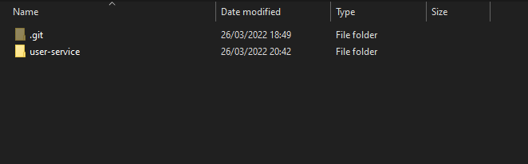
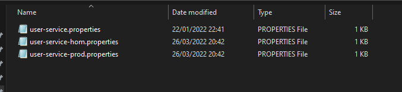

## Environment Variables

CONFIG_REPOSITORY_URI=C:/Users/rodri/IdeaProjects/webflux/config-values/

## Vault, Consul and MongoDB containers commands

docker run -p 8200:8200 -d --name=dev-vault --cap-add=IPC_LOCK -e 'VAULT_DEV_ROOT_TOKEN_ID=myroot' vault

docker run -p 8500:8500 -d --name=dev-consul -e CONSUL_BIND_INTERFACE=eth0 consul

docker run -p 27017:27017 -d --name dev-mongodb -e 'MONGO_INITDB_ROOT_USERNAME=mongouser' -e 'MONGO_INITDB_ROOT_PASSWORD=mongopassword' mongo

## Properties values saved in other repository

spring.data.mongodb.authentication-database=admin
spring.data.mongodb.auto-index-creation=true
spring.data.mongodb.host=localhost
spring.data.mongodb.port=27017
spring.data.mongodb.username=mongouser
spring.data.mongodb.password=mongopassword
spring.data.mongodb.database=webflux-prod

## Repository structure to store configurations used by Spring Cloud Config

user-service -> user-service.properties

user-service -> user-service-hom.properties

user-service -> user-service-prod.properties

